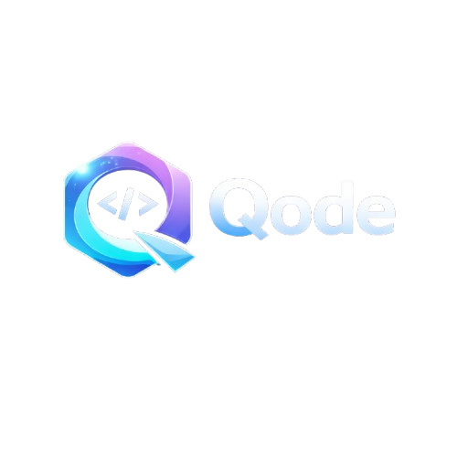

# Qode



Qode is a local-first, multi-agent AI development environment that transforms individual AI models into a collaborative intelligent workforce.

It enables developers to orchestrate multiple AI agents—each with its own role, model, and policy—working together as a coordinated team to solve complex engineering, research, and automation tasks.

---

## 🌟 Vision

Qode aims to become the operating system for collaborative AI, where multiple specialized AI agents work together like real software teams.

Instead of relying on a single AI model, Qode enables structured AI collaboration:
- One agent designs architecture
- One writes code
- One reviews security
- One manages planning
- One validates results

---

## 🚀 Key Features

- Multi-Agent AI System  
- Local-first architecture  
- Cloud AI integration  
- OpenAI / Google AI / Ollama / LM Studio support  
- Role-based AI agents  
- Custom policies per agent  
- Team-based AI collaboration  
- Extensible architecture  

---

## 🏠 Home Screen


---

## 💻 Code Editor


---

## ☁️ Global APIs


---

## 🧠 Local LLMs


---

## ⚙️ Settings


---

## 👥 Teams


---

## 🔑 How It Works

Each agent has:
- Role
- Model
- Policy
- Independent context

Agents collaborate like a real engineering team.

---

## ⚡ Quick Start

```bash
git clone https://github.com/yourname/qode.git

## 📈 Why Qode

Qode introduces AI team collaboration instead of single-model usage, enabling:

- Better accuracy  
- Specialized reasoning  
- Parallel task execution  
- Enterprise workflows  
cd qode
dotnet run
